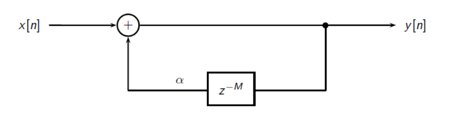

## Explanation of the Code

The Karplus-Strong algorithm is a simple digital feedback loop with an internal buffer of M samples. The buffer is filled with a set of initial values and the loop, when running, produces an arbitrarily long output signal. The K-S loop can be used to synthesize interesting musical sounds.

I started with a basic implementation of K-S loop.

  

