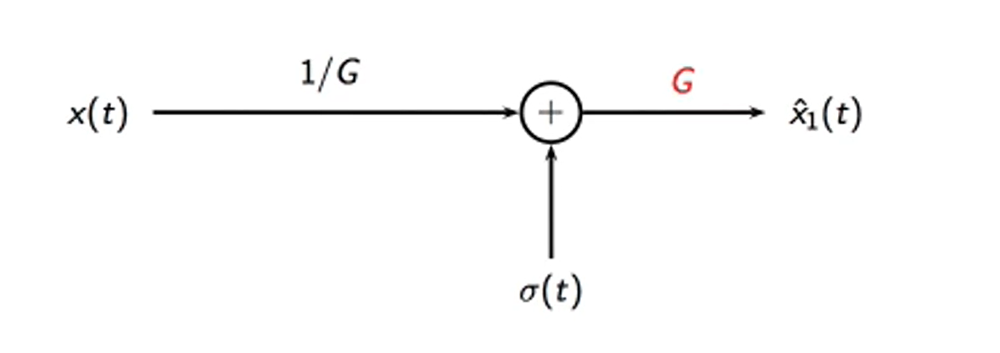

  <h1 align="center">TRANSOCEANIC SIGNAL TRANSMISSION</h1>

## Explanation of the code

I considerd the case of transmission over a long (e.g. transoceanic) cable in which several repeaters are used to compensate for the attenuation introduced by the transmission.

If each cable segment introduces an attenuation of 1/G , I can recover the original amplitude by boosting the signal with a repeater with gain G . However, if the signal has accumulated additive noise, the noise will be amplified as well so that, after N repeaters, the noise will have been amplified N times:

**x̂ N(t)=x(t)+NGσ(t)**
 
If I use a digital signal, on the other hand, I can threshold the signal after each repeater and virtually eliminate the noise at each stage, so that even after several repeaters the trasmission is still noise-free.

  

I initialized all the libraries. I read in an audio file from disk and I can plot it and play it back. The wavfile.read() function returns the audio data and the playback rate, which I will need to pass to the playback functions.

I created two version of the audio signal, an "analog" version and a "digital" version. Obviously the analog version is just a simulation, since I am using a digital computer; I will have to assume that, by using floating point values, I am in fact close enough to infinite precision. In the digital version of the signal, on the other hand, the audio samples will only take integer values between -100 and +100 (i.e. using approximately 8 bits per audio sample).

Quantization implies a loss of quality; this initial loss (that I can minimize by using more bits per sample) is the price to pay for digital transmission. Now I plot the error and compute the Signal to Noise Ratio (SNR) of the quantized signal.

The error is between -0.5 and +0.5, since in the "analog" signal the values are real-valued, whereas in the "digital" version they can only take integer values. 

I now define a function that represents the net effect of transmitting audio over a cable segment terminated by a repeater:

* the signal is attenuated

* the signal is accumulates additive noise as it propagates through the cable

* the signal is amplified to the original amplitude by the repeater

I used the repeater for both analog and digital signals. Transmission of the analog signal is simply a sequence of repeaters. For digital signals, however, I can rectify the signal after each repeater, because we know that values should only be integer-valued.

## Results

In the first half of the notebook, we can actually hear the difference of 17dB between the two signals.

On comparing transmission schemes, we can see, that the SNR after digital transmission has not changed! Now the difference between audio clips should be easy to hear. However that, if the noise amplitude exceeds a certain value, digital transmission degrades even less gracefully than analog transmission.
